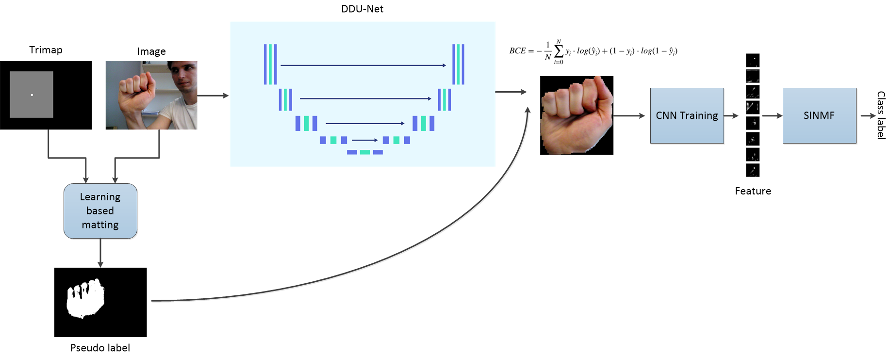

# THMS-2023
This is the code for my IEEE Transaction on Human-Machine Systems paper titled [*"Hand segmentation with dense dilated U-Net and structurally incoherent non-negative matrix factorization based gesture recognition"*]. I hope you find this useful
# Proposed Algorithm
The proposed algorithm in the paper *["Hand segmentation with dense dilated U-Net and structurally incoherent non-negative matrix factorization based gesture recognition"]* has three major steps. The end goal of our algorithm is to perform hand gesture recognition. We identified the problem as a two-step problem. (I) Hand segmentation and (II) Hand gesture recognition. In the current literature, there are very few approaches that perform joint hand segmentation + gesture recognition. The main reason is being the dataset for hand gestures does not normally come with the segmentation mask. We tackle the first sub-problem as a semi-supervised hand segmentation approach considering that there is no segmentation mask available. This step is handled by learning-based matting. The code is also subdivided into three folders.

## Step 1: Learning Based Matting:
The code is developed from a well-known work "Learning based digital matting". We use image matting to generate pseudo-labels from bounding box over hand regions which can be easily drawn or already available.

You need to have tight bounding boxes over hand regions for intended images to be processed in MATLAB format (Please check the MATLAB documentation for this). By running the MATLAB code in the **Image based matting** folder named `segmentAndCropData.m` you will generate the pseudo-segmentation label for the next step. Check for the inline comments in the code where you have to give your folder path for images and generated segmentation labels.

## Step 2: Hand Segmentation: 
### Dependencies:
This tutorial depends on the following libraries:

* Tensorflow-gpu == 1.5.0
* Keras == 2.1.5

Also, this code should be compatible with Python versions 2.7-3.5.
### Model:
This deep neural network is implemented with Keras functional API, which makes it extremely easy to experiment with different interesting architectures.

Output from the network is a 512*512 which represents a mask that should be learned. Sigmoid activation function
makes sure that mask pixels are in \[0, 1\] range.
### Data:
The data should be stored in the following structure:
#### Project tree

 * [dir](./dir)
   * [train](./dir/train)
     * [image](./dir/train/image)
       *  [0.png](./dir/train/image/0.png)
       *  [1.png](./dir/train/image/1.png)
     * [label](./dir/train/label)
       *  [0.png](./dir/train/label/0.png)
       *  [1.png](./dir/train/label/1.png)
   * [val](./dir/val)
      * [image](./dir/val/image)
        *  [0.png](./dir/val/image/0.png)
        *  [1.png](./dir/val/image/1.png)
      * [label](./dir/val/label)
        *  [0.png](./dir/val/label/0.png)
        *  [1.png](./dir/val/label/1.png)
    * [test](./dir/test)
       * [image](./dir/test/image)
         *  [0.png](./dir/test/image/0.png)
         *  [1.png](./dir/test/image/1.png)
       * [label](./dir/test/label)
         *  [0.png](./dir/test/label/0.png)
         *  [1.png](./dir/test/label/1.png)  
 
The code for this part can be found in the folder **DDU-NET**. To prepare the data, we provided the code `generateDataForUnet.m` which will convert the data into the above file structure. Then you should run the `maindensedilatedunet.py` for training and generating the segmentation results. The code `segmentAndCropData.m` is responsible for segmenting the hands using the generated mask in the previous step and taking a tight crop around the hand region after segmentation for the gesture recognition step.
 

